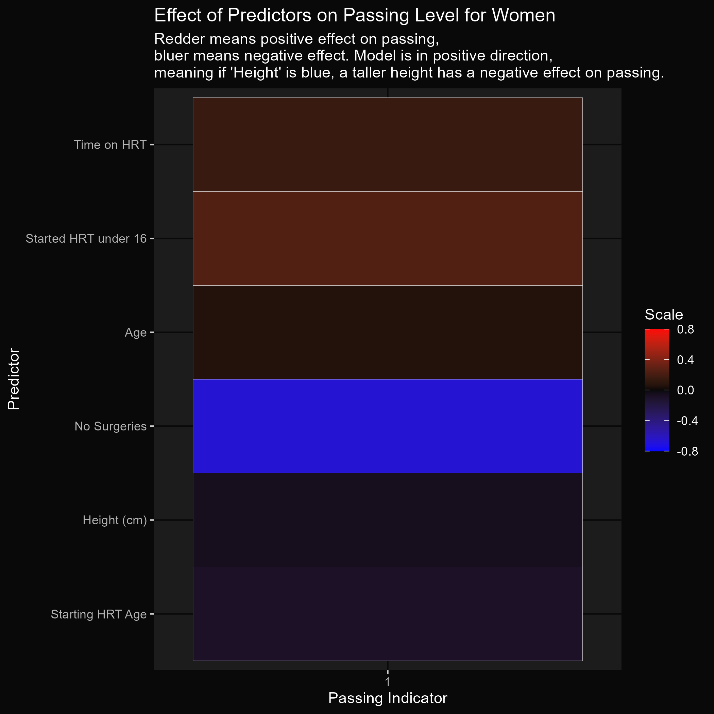
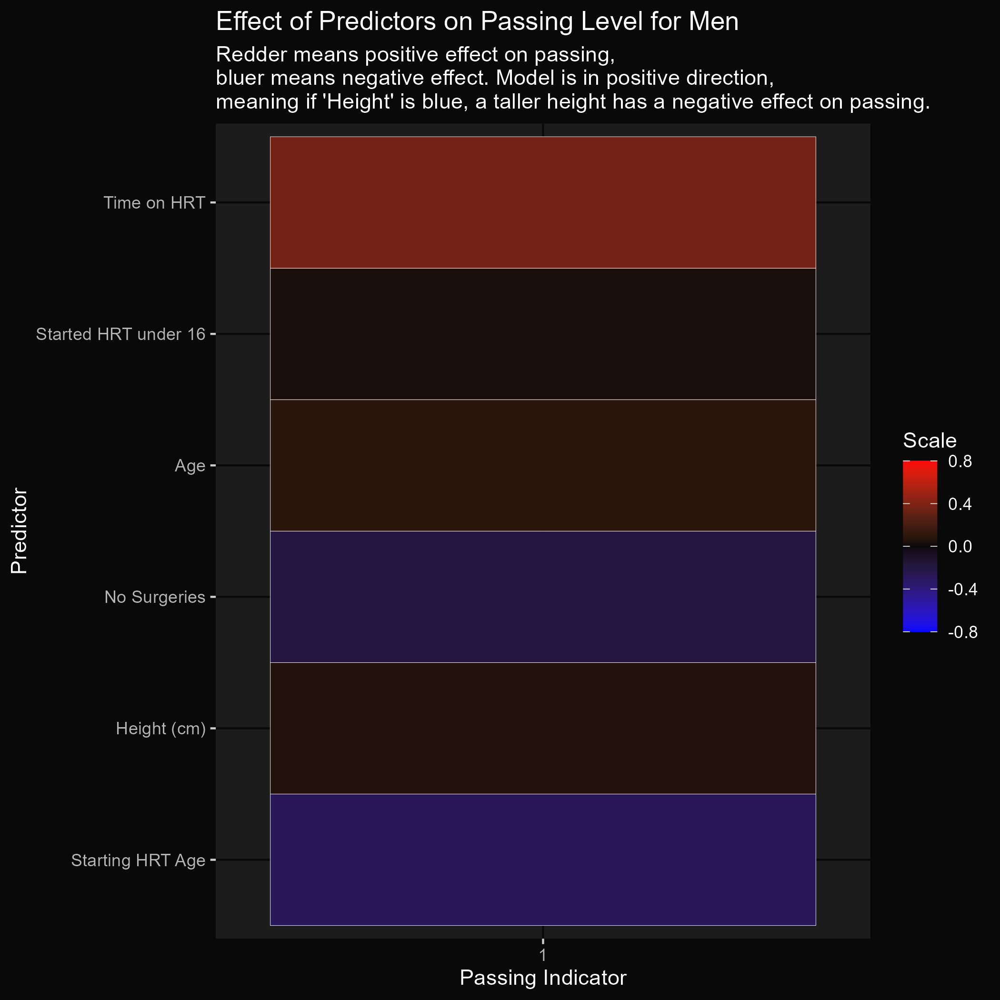
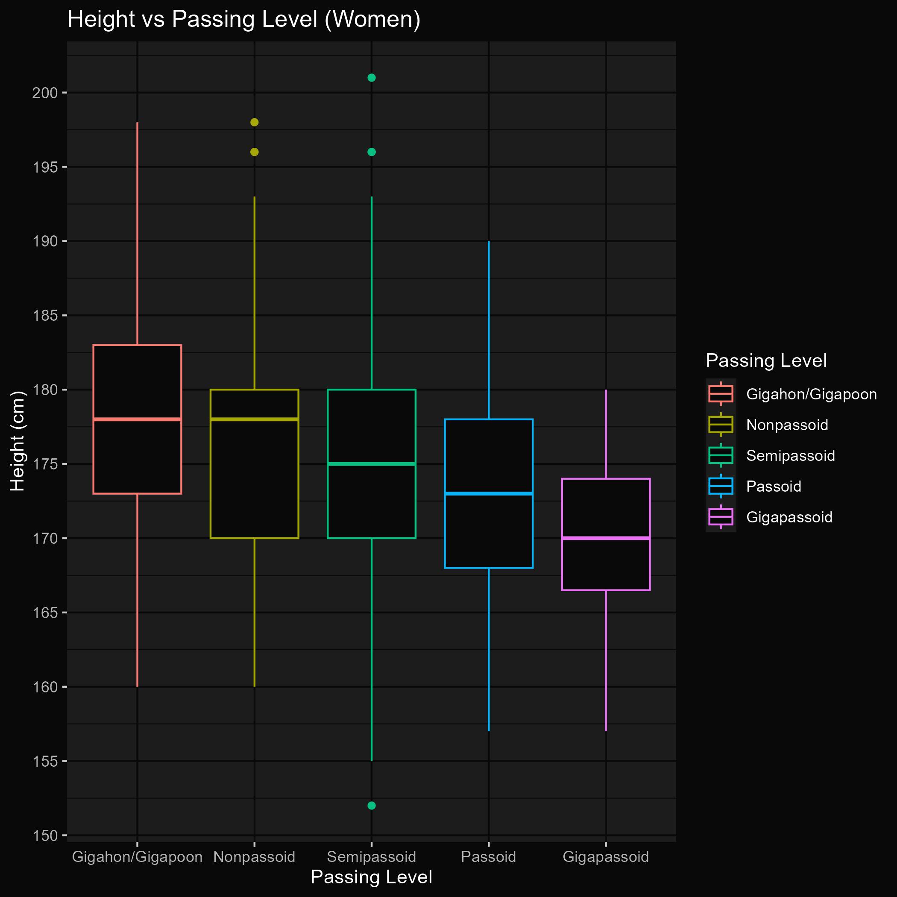
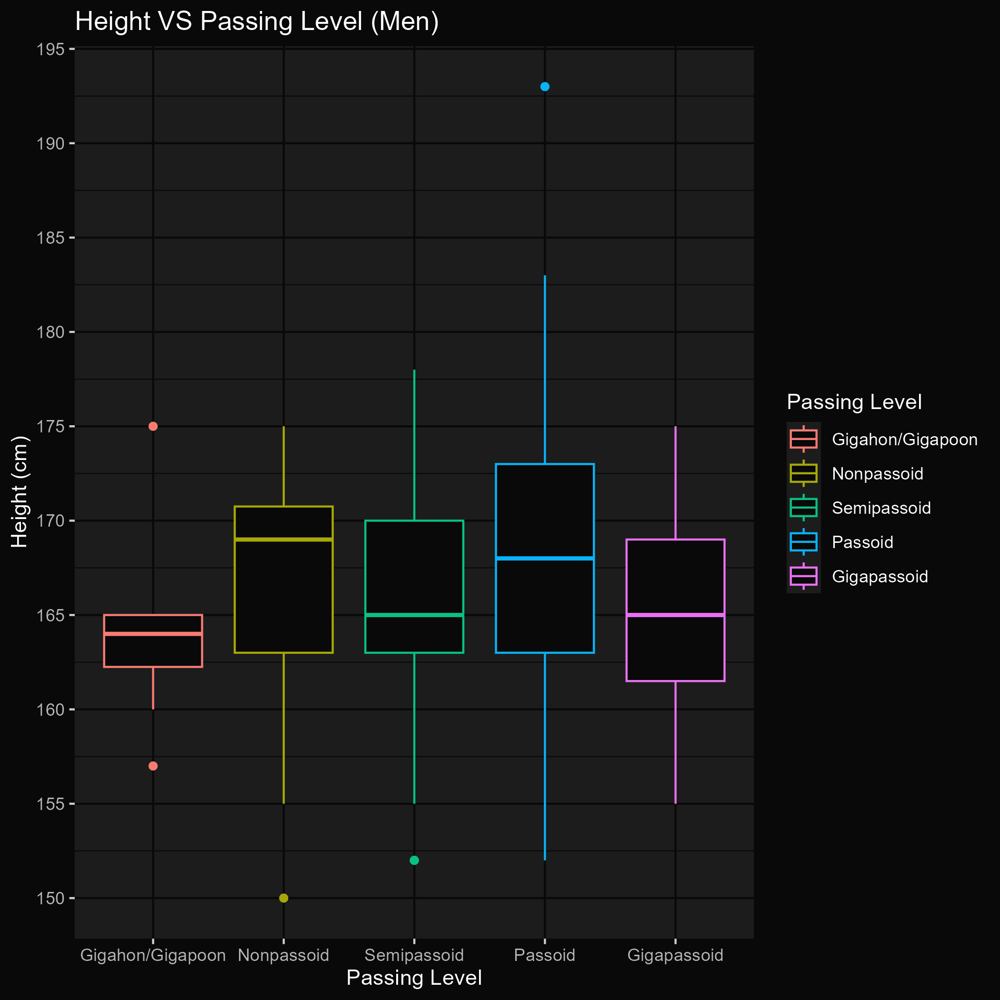
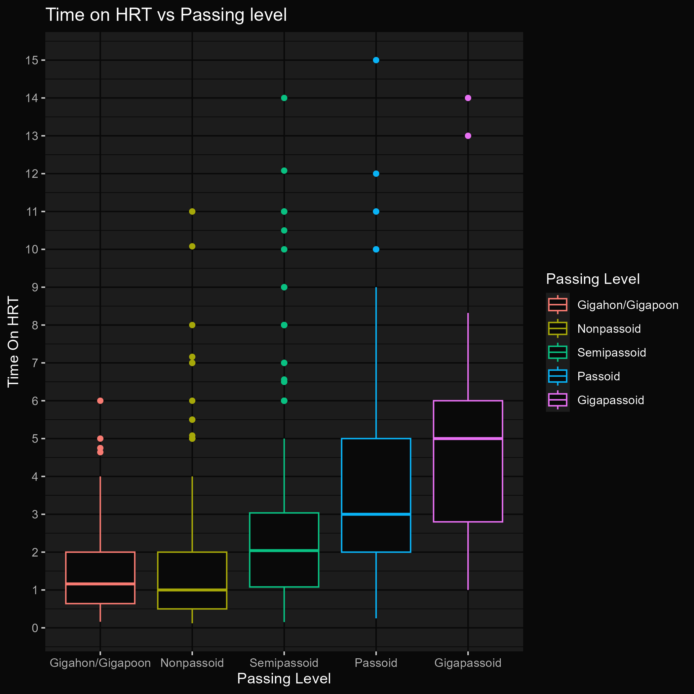
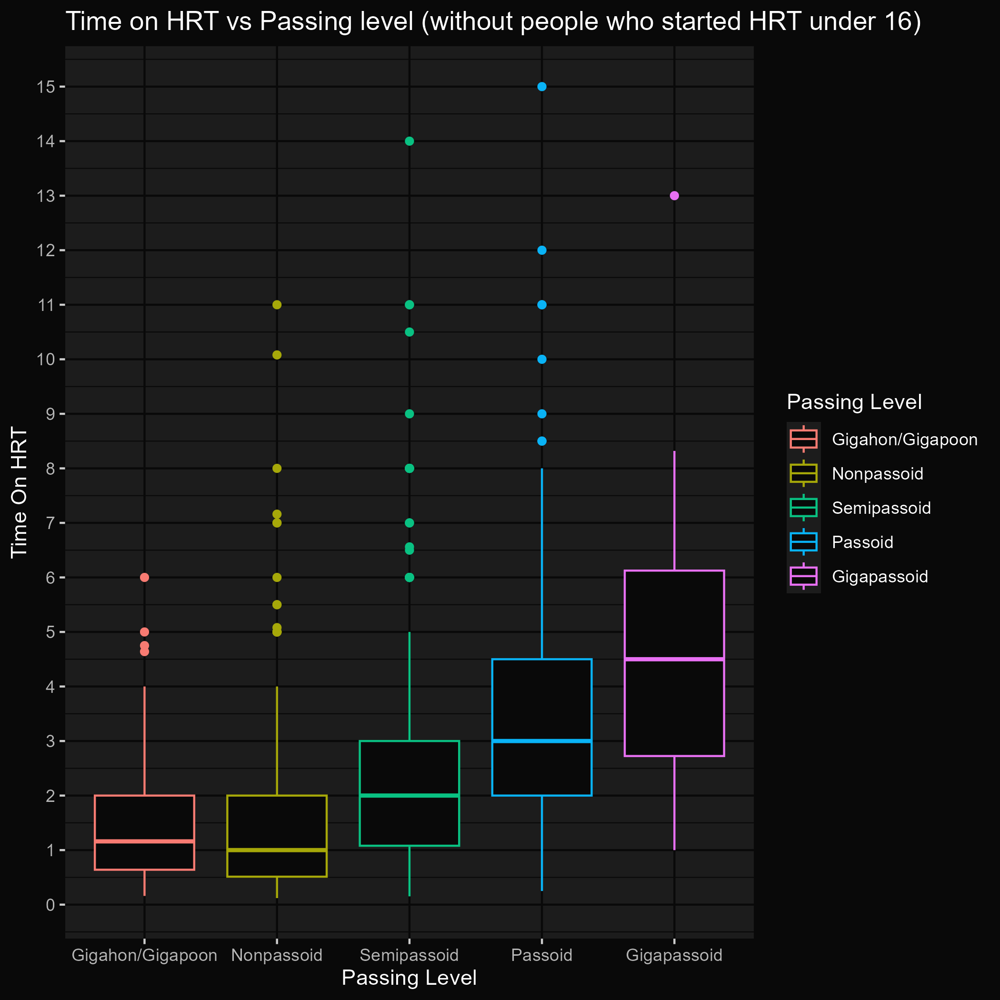
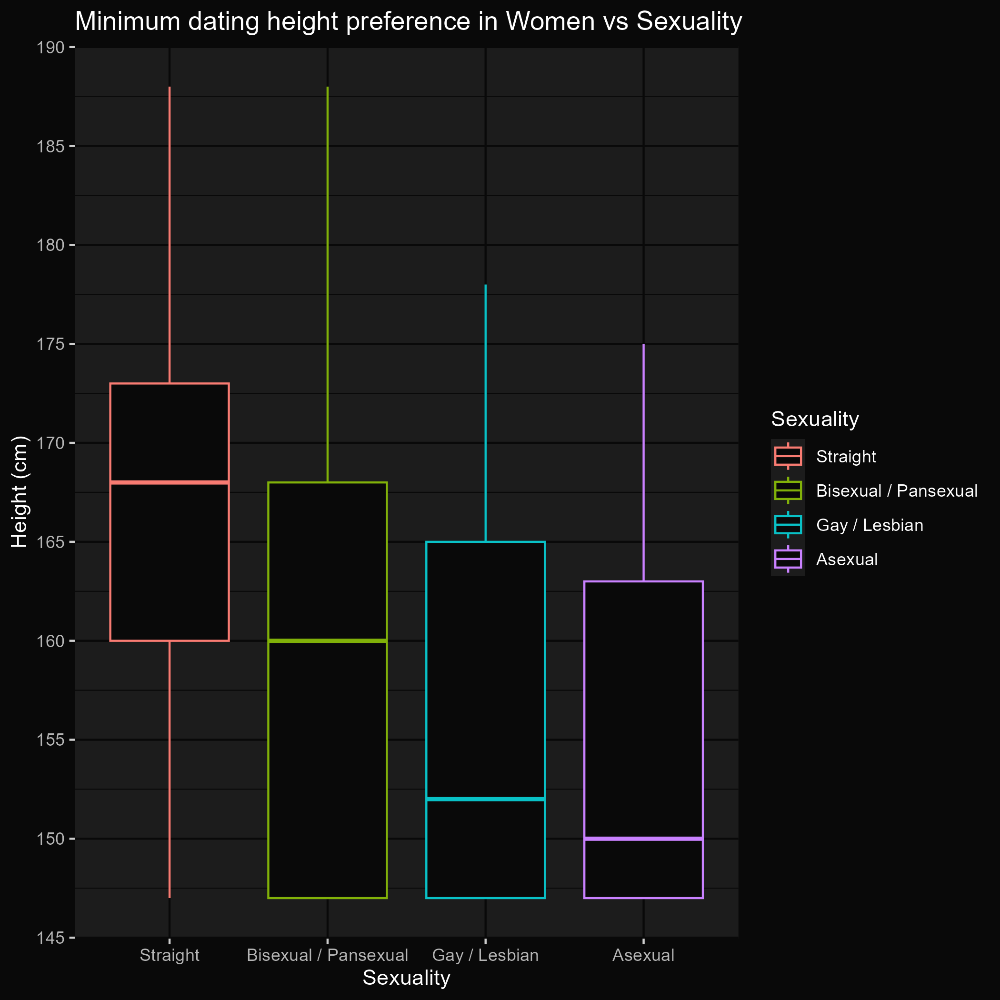
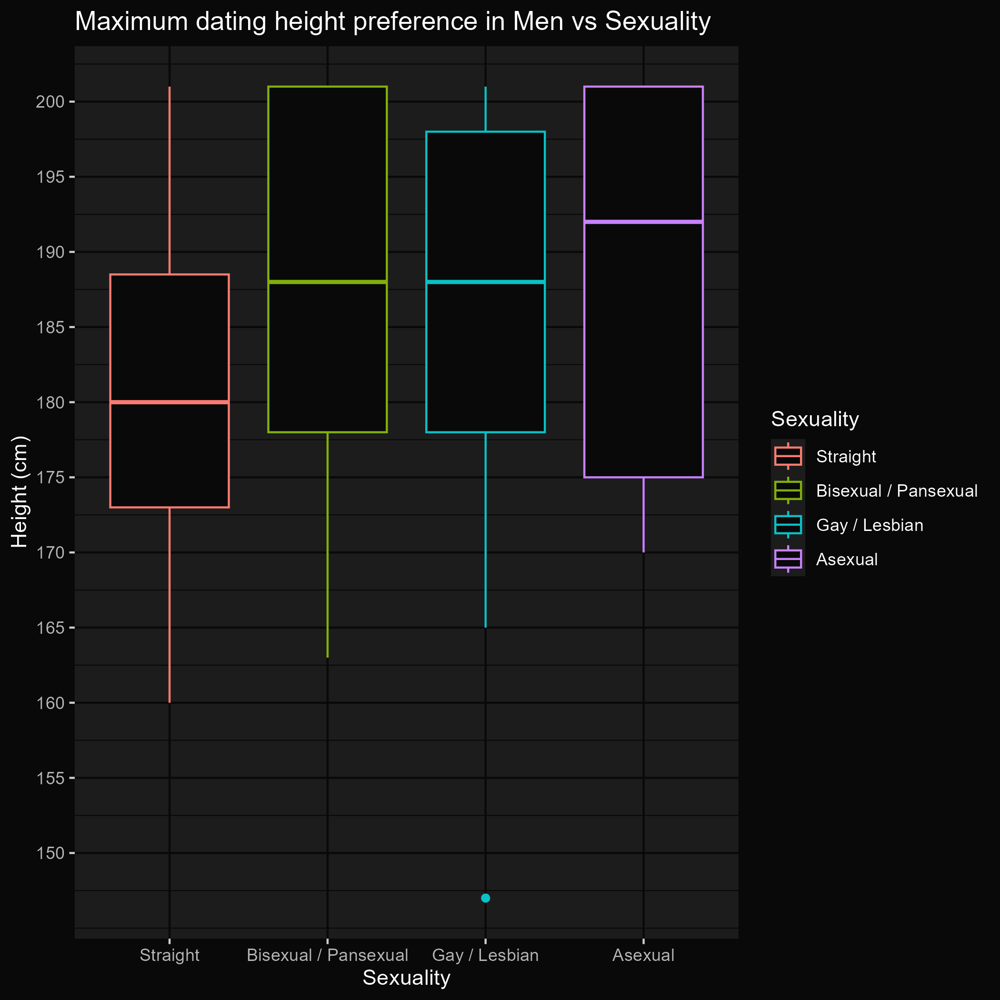
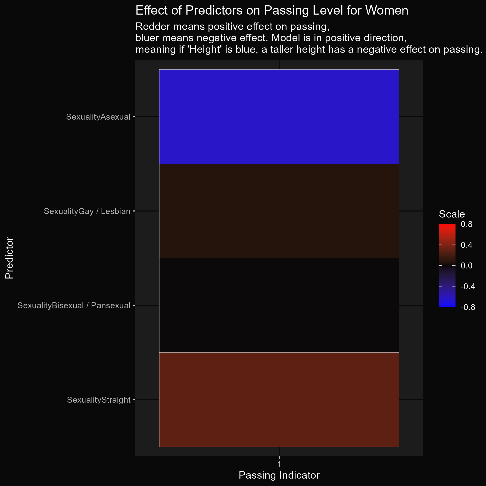
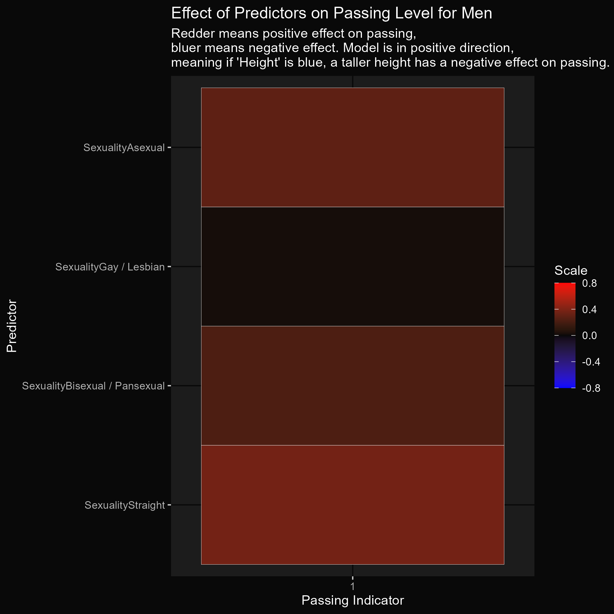

<link rel="stylesheet" href="https://cdnjs.cloudflare.com/ajax/libs/font-awesome/6.5.2/css/all.min.css">

# The 2025 4tran Survey
<h6 style="margin: 0 0.2rem">Ratgirltwink's Analysis</h6>

  <a href="../">Page 1</a> - 
  <a href="../2">Page 2</a> - 
  <a href="../3">Page 3</a> - 
  <a href="../4">Page 4</a> - 
  <a href="../jealouscat">Jealous Cat</a> - 
  <a href="../ratgirltwink" class="active">Ratgirltwink</a>

  This page is written by Ratgirltwink: 
  <a class="noselect reddit" style="margin-right: 0.15rem;" href="https://www.reddit.com/user/ratgirltwink" target="_blank">
    <i class="fa-brands fa-reddit-alien" style="margin-right: -0.1rem;"></i>
    Reddit
  </a>

## Considerations

It is important to realize that causation != correlation, and this data has a large amount of selection bias being just from 4tran communities, so its important to take these relationships with a grain of salt.

The data was filtered and recategorized in several ways:

-	Removed anyone that didn’t specify their passing level
-	Removed anyone less then 0.1 years on HRT
-	Removed anyone that didn’t specify their gender between Man (FtM), Woman (MtF), and nonbinary, effectively removing cissoids and some other odd answers (possibly reppers too ☹)
-	Removed anyone who stated they started HRT below 8 years old, or above 50 years old
-	Anyone who started HRT below 16 was given the youngshit categorization
-	Height converted to metric

With these changes, the total responses dropped from 1478 to 1122, with 215 being Men, and 860 being Women, and 47 being nonbinary. Most of the analysis will be centered around Men and Women (sorry nonbinoids ☹).

___

## Data

### Predictors of passing

For only this data, I combined gigapassoid and passoid into the same passoid category.
I also added semipassoids to the passoid category who said they feel as if they will become passoids or gigapassoids in the future. I did this specifically because of people like windblown and soph btw, who are just passoids but refuse to say it.

You can click on charts to expand them!

  
  

It seems that for Men, the biggest contributing factor to passing is time on HRT. Whereas for Women, it’s whether you are a youngshit, or have surgeries.

### Height vs Passing level

  
  

The graph for men doesn’t look smooth. This is probably because there is only 200 responses from men, making the graph less consistent.

### Time on HRT vs Passing Level

  
  

Seems like after 3 years, 50% of people become Passoids. After 5 years, 75% become passoids.

Taking out youngshits, the graph is not meaningfully different. The 3rd quartile (75%) for passoids moves down to 4.5 years, and same with the median for Gigapassoids. 

This may seem counterintuitive at first. However, it makes sense that removing youngshits, who having been on HRT for sometimes 6-15 years, would bring the 3rd quartile down for HRT time for Passoids.

### Dating height preferences vs Sexuality

For these graphs, I will only look at Minimum height preferences for Women, and Maximum dating height preferences for Men, since I feel the inverse is less interesting. Those who did not specify these statistics were excluded.

  

    
    
The median height preferences for Women (inches):

    <ul>
      <li>Straight: 5’6”</li>
      <li>Bisexual: 5’3”</li>
      <li>Lesbian: 5’0”</li>
      <li>Asexual: 4’11”</li>
    </ul>
  

  

    
    
The median height preferences for Men (inches):

    <ul>
      <li>Straight: 5’11”</li>
      <li>Bisexual: 6’2”</li>
      <li>Gay: 6’2”</li>
      <li>Asexual: 6’4”</li>
    </ul>
  

### Age when HRT was started vs Current age

This was a requested graph. The user wanted to see how many years on HRT the average person is depending on their age.

### Effect of sexuality on passing

  
  

Hsts > agp lol

___

  <a class="big-button" href="../jealouscat">Previous Page</a>

